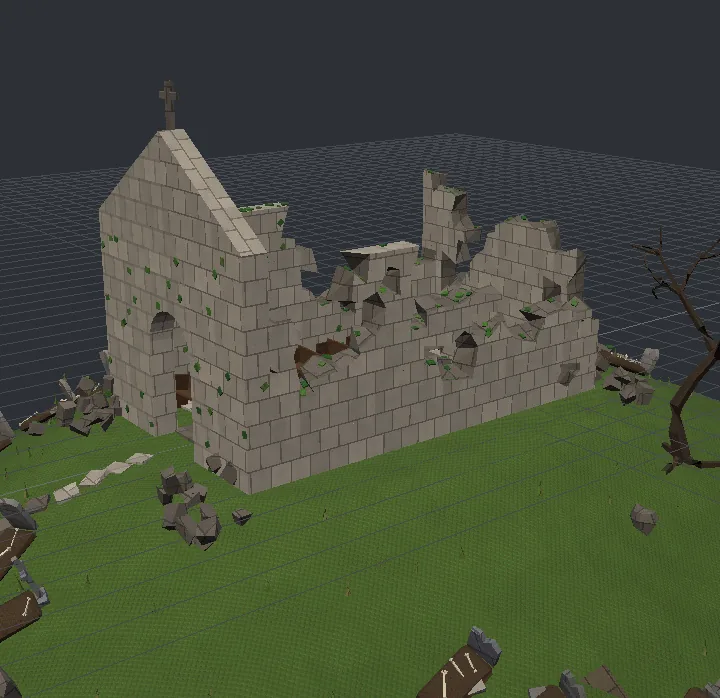
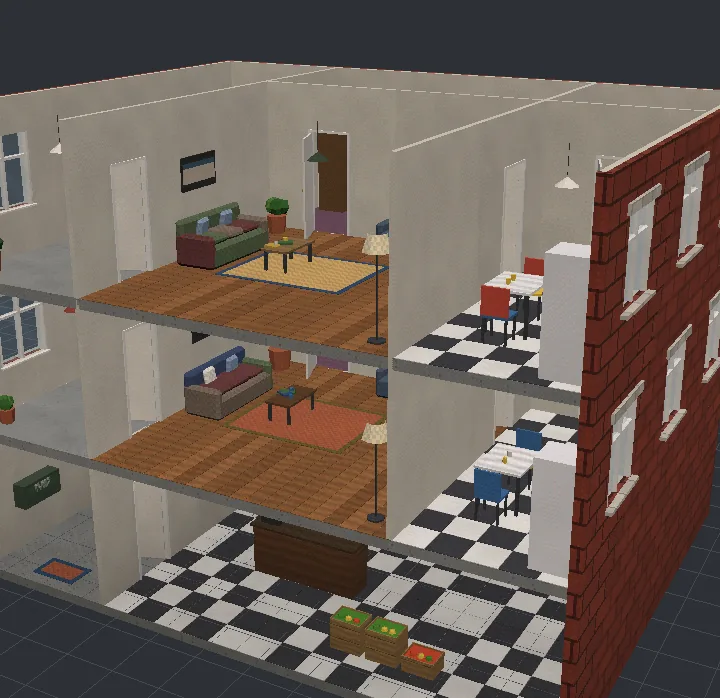
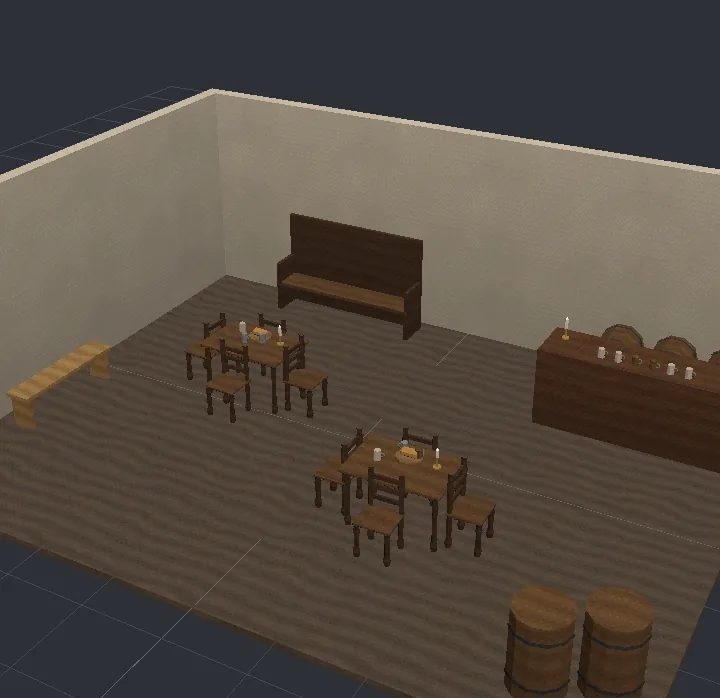
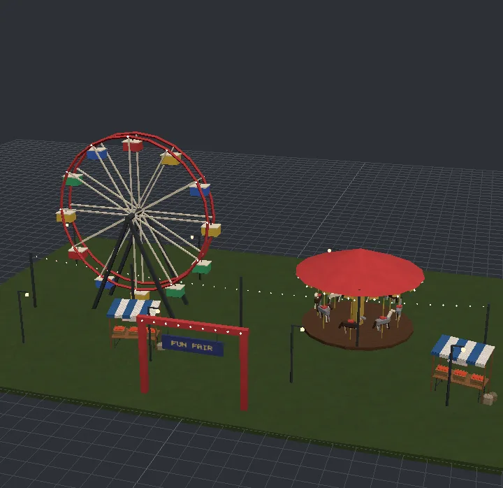
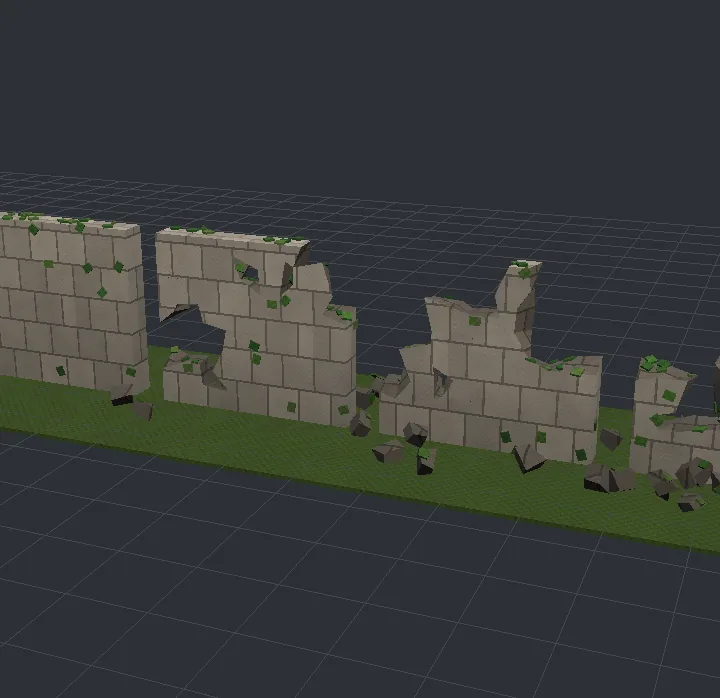
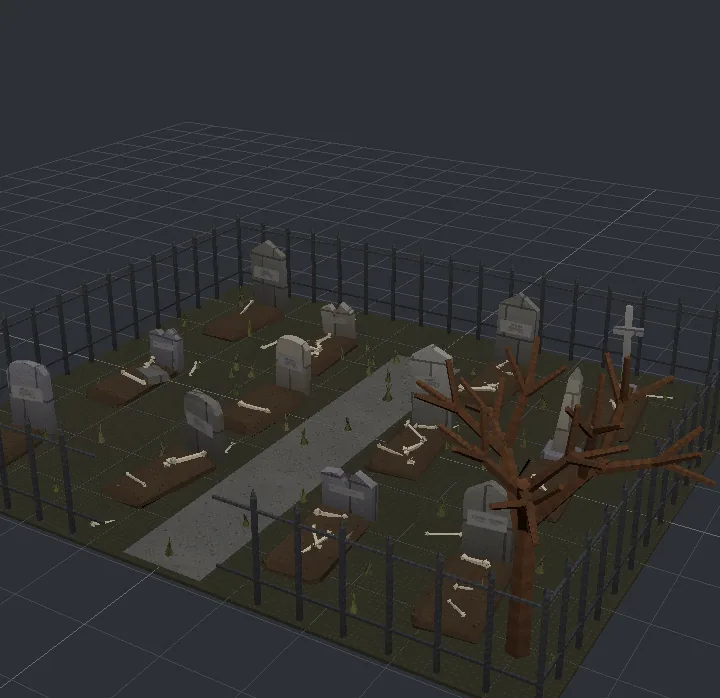
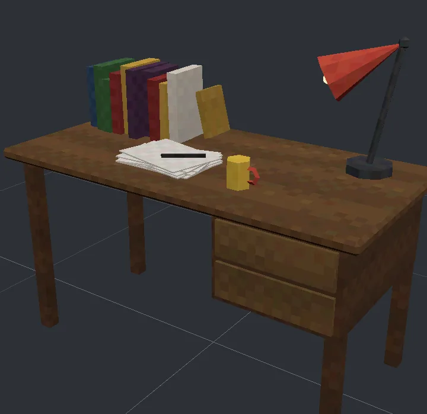
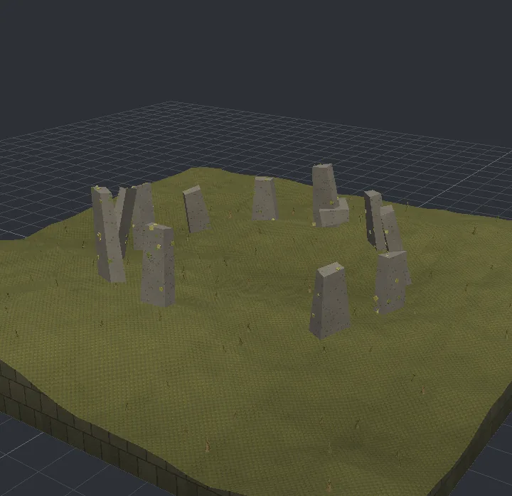

# PartScript

Low-poly props in a few words. PartScript is a small language for modelling game props: boxes,
cylinders, lathes, extrusions, pipes and reusable parts, a few words a line, dozens of props a file.
It compiles to `.glb` (glTF 2.0) in pure Python. No Blender needed.

```
prop street_lamp "Street Lamp" street
  lathe at=0,0,0 mat=steel_dark .19:0 .19:.07 .15:.11 .11:.42 .085:.5 .06:.58 sides=10 cap=1
  cylinder at=0,0,on(.58) radius=.05 height=2.5 mat=steel_dark sides=8
  cylinder at=0,0,on(3.13) radius=.12 height=.34 mat=lamp_warm sides=6 top_radius=.16
  box at=.14,0,3.3 size=.025,.025,.36 mat=steel_dark ring 6 step 60
  cone at=0,0,on(3.47) radius=.22 height=.16 mat=steel_dark sides=6
```

```sh
pip install partscript
partscript build props/ -o out/      # every prop as out/<id>.glb
partscript check props/              # names, materials, triangle estimates; instant
partscript ref                       # the whole language on one page
```

Docs and an in-browser playground: [partscript.dev](https://partscript.dev). The documentation's source is
[`docs/`](docs/index.md): start with the [tour](docs/start/tour.md), look things up in the
[reference](docs/reference/statements.md).

## Showcases

Every picture is one of the [example files](examples/), built by PartScript and nothing else. Open any
of them in the playground to change it, or see the [gallery](docs/guides/gallery.md) for how each is made.

<table>
<tr>
<td width="50%"><br>
<b>Hill chapel</b> (<code>ruins.parts</code>): a hill of <code>terrain</code>, walls knocked apart with
<code>break=</code>, moss and ivy grown on with <code>scatter on</code>, graves dropped onto the slope.</td>
<td width="50%"><br>
<b>Apartment block</b> (<code>buildings.parts</code>): a kit of walls, floors and stairs laid out room by
room, every room furnished by a part that knows its size and doors.</td>
</tr>
<tr>
<td><br>
<b>Tavern</b> (<code>tavern.parts</code>): built from two imported libraries, their parts called like
shapes: <code>furniture.table</code>, <code>tankard</code>.</td>
<td><br>
<b>Fairground</b> (<code>fairground.parts</code>): gondolas placed round the wheel with
<code>cos()</code> and <code>sin()</code>, horses out of step, bulbs strung with <code>hang=</code>.</td>
</tr>
<tr>
<td><br>
<b>Ruin stages</b>: one wall at <code>break=0</code>, <code>.2</code>, <code>.4</code> and <code>.6</code>,
its rubble dropped round its foot.</td>
<td><br>
<b>Graveyard</b> (<code>graveyard.parts</code>): no two stones alike, each with its own name, dates and
lean, drawn with <code>rand()</code> and <code>pick()</code>.</td>
</tr>
<tr>
<td><br>
<b>Writer's desk</b> (<code>layout.parts</code>): placed by name with <code>on=</code>, <code>row</code>
and <code>stack</code>: no coordinates added up.</td>
<td><br>
<b>Standing stones</b>: a ring dropped onto a moor with <code>drop=lean</code>, one fallen, lichen
on their faces.</td>
</tr>
</table>

## Two ways to write it

Every line can be written out in words or in shorthand, and both build the same model. The examples are
written in words; `partscript fmt --terse` and `partscript fmt --readable` rewrite a file either way.

| In words | Shorthand |
|---|---|
| `box at=0,0,on size=.4,.3,.2 mat=wood` | `b 0,0,~ .4,.3,.2 wood` |
| `cylinder at=0,0,on(.8) radius=.1 height=.5 mat=brass sides=8` | `c 0,0,~.8 .1 .5 brass s=8` |
| `turn=0,0,45` / `top_radius=` / `axis=` / `jitter=` | `r=0,0,45` / `rt=` / `ax=` / `jit=` |
| `repeat 5 every .3,0,0` / `grid 4x3 every .2,.2` | `*5@.3,0,0` / `*4x3@.2,.2` |
| `ring 6` / `ring 6 step 30` | `*6%60` / `*6%30` |
| `scatter 40 over 2,1 apart .1` / `scatter 5 within 1.2` | `*40~2,1,.1` / `*5~1.2` |
| `mirror x` / `mirror xy` | `mx` / `mx my` |

`on` in a position sits the shape on that height (`at=0,0,on` stands it on the floor, `on(.8)` on top of 0.8).

## Examples

`examples/` has a street, a market, a cafe and a library; every snippet here is taken from those files.

A traffic cone in two colours (`for` makes a variant per value). Numbers are expressions, so the
reflective bands can work out the cone's radius at their own height:

```
prop traffic_cone_{c} "Traffic Cone" street for c=e25a1a,d8c020
  set rb=.16 rt=.03 ch=.64 z0=.05
  bevel_box at=0,0,on size=.42,.42,.05 bevel=.015 mat=rubber
  cylinder at=0,0,on(z0) radius=rb height=ch mat=#{c}/plastic top_radius=rt sides=12
  set slope=(rb-rt)/ch band=#ece8dc/plastic
  set r0=rb-slope*(.28-z0)+.004 r1=rb-slope*(.38-z0)+.004
  cylinder at=0,0,.33 radius=r0 height=.1 mat=band top_radius=r1 sides=12 caps=0
  set r0=rb-slope*(.48-z0)+.004 r1=rb-slope*(.555-z0)+.004
  cylinder at=0,0,.52 radius=r0 height=.07 mat=band top_radius=r1 sides=12 caps=0
```

A car from two outlines pushed through (`ext`), the glass cabin narrowing toward its roof, on four std wheels
placed by one mirrored line:

```
prop hatchback "Hatchback" street hero=1
  set paint=#c83a2a/metal
  extrude at=0,0,0 width=1.64 mat=paint -1.86:.32 1.86:.32 1.92:.56 1.8:.8 .85:.92 -1.72:.92 -1.92:.64 axis=y
  extrude at=0,0,0 width=1.46 mat=glass_opaque .85:.92 .3:1.33 -1.3:1.36 -1.72:.94 axis=y taper=.88
  box at=-.5,0,1.375 size=1.64,1.29,.05 mat=paint
  box at=-.45,0,1.14 size=.1,1.4,.44 mat=paint
  wheel at=1.2,.75,.32 turn=0,0,90 mirror xy
```

A row of books: three runs of copies (`repeat N every ...`) whose colours cycle (`a|b|c`) and whose spines are
nudged (`jit=`), so every shelf of a bookcase looks different:

```
def book_row w=.9
  box at=-w/2+.02,0,on size=.03,.2,.24 mat=#8a1c22/paint|#2a4a7a/paint|#3a6a3a/paint|#c8a040/paint jitter=.004,2 skip=-z,+y repeat (w/.1) every .1,0,0
  box at=-w/2+.055,0,on size=.028,.19,.2 mat=#5a3a22/paint|#d8d0c0/paint|#2a2a3a/paint jitter=.004,2 skip=-z,+y repeat (w/.1) every .1,0,0
  box at=-w/2+.085,0,on size=.022,.21,.27 mat=#6a2a5a/paint|#c86a2a/paint|#2a6a6a/paint|#e8e0d0/paint jitter=.004,2 skip=-z,+y repeat (w/.1-1) every .1,0,0
```

## Variety

Lines that make copies can make every copy different. `i` is the copy's number, `rand(lo,hi)` draws a
number for it and `pick(a,b,c)` chooses from a list; `scatter N over W,D` spreads copies over an area, `when=` keeps a
copy only while a condition holds, and `fade=` darkens a shape toward its base. Draws are seeded, so a
file always builds the same prop (`seed=N` on a prop deals it again).

A bed of forty flowers, each its own colour, height and lean:

```
prop flower_bed "Flower Bed" garden hero=1
  box at=0,0,on size=1.8,.9,.12 mat=#5a3a22/concrete
  flower at=0,0,.12 h=rand(.22,.38) col=pick(#e84a6a,#f0d040,#f0f0f0,#8a4ac8,#e8823a)/plastic turn=rand(-10,10),rand(-10,10),rand(0,360) scatter 40 over 1.6,.75 apart .09
```

A tree is a branch carrying three smaller branches; the branch uses itself until `when=` stops it, and
grows leaves at the tips:

```
def branch len=1 rad=.08 depth=3 leaf=pick(#3a6a2a,#4a7a2a,#2a5a2a)/fabric
  cylinder at=0,0,on radius=rad height=len mat=#5a3a22/wood top_radius=rad*.7 sides=5 fade=.7
  branch at=0,0,len*rand(.7,.95) turn=rand(28,42),0,i*120+rand(-25,25) scale=.68 len=len rad=rad depth=depth-1 leaf=leaf when=depth>0 ring 3 step 0
  sphere at=0,0,len radius=rand(.35,.5)*len mat=leaf sides=6 rings=4 when=depth==0
```

A picket fence whose pickets alternate in height and one is missing:

```
prop picket_fence "Picket Fence" garden
  box at=-w/2+.1,0,on size=.08,.02,.85+.06*(i%2) mat=paint taper=.4,1 when=i!=13 fade=.75 repeat n every (w-.2)/(n-1),0,0
```

### A graveyard where nothing repeats

`examples/graveyard.parts` builds every headstone in one of five shapes with its own lean, weathering
(`wobble=`), name and dates (label text takes `pick()` and `{expressions}`), and every grave its own
mound with one to four bones pushing up out of it, each bone a different length, thickness and angle:

```
def grave kind=0 stone=#8a8a84/stone
  group at=0,0,0 turn=rand(-7,7),rand(-5,5),rand(-6,6) {
    headstone kind=kind w=rand(.5,.7) h=rand(.75,1.05) stone=stone
  }
  bevel_box at=0,-.8,on(-.08) size=.8,1.45,.22 bevel=.08 mat=#4a3a28/concrete taper=.85,.9 wobble=.035,.035,.04 fade=.7
  bone at=0,-.8,.16 len=rand(.3,.55) rad=rand(.017,.03) turn=rand(35,70)*pick(-1,1),rand(-25,25),rand(0,360) wobble=.006 scatter (floor(rand(1,5))) over .25,1.05 apart .2
  skull at=rand(-.2,.2),-1.25,.05 rad=rand(.085,.11) turn=rand(-30,30),rand(-20,20),rand(-70,70) when=rand()<.35 wobble=.005
```

## More detail

`torus` makes rings and tyres, `frame` a panel with a hole, `smooth=N` curves a pipe or an `along=` line
through its points, and `twist=`, `bend=` and `shrink=` reshape whatever a line or group makes by height.
`repeat ... as k` names a copy's number (`grid 3x3 ... as col,row` gives a grid's column and row), and
`if EXPR { }` keeps a group only while a condition holds. From `examples/showpieces.parts`:

```
def helm rad=.45 handles=1 wood=#6a4a2a/wood
  torus at=0,0,0 radius=rad thick=.035 mat=wood sides=24 rings=6
  box at=rad/2,0,0 size=rad,.035,.035 mat=wood ring 8
  if handles == 1 {
    lathe at=rad+.02,0,0 mat=wood 0:0 .03:.01 .025:.08 .035:.13 .001:.17 sides=8 turn=0,90,0 ring 8
  }
```

```
prop twisted_column "Twisted Column" showpieces
  group twist=90 {
    bevel_box at=0,0,on(.2+k*.2) size=.42,.42,.2 bevel=.05 mat=#e0d8c8/stone repeat 12 every 0,0,0 as k
  }
```

```
def vine drop=.8 lean=.3
  set path="0,0,0 lean*.5,.05,-drop*.3 lean*.8,-.05,-drop*.65 lean,0,-drop"
  pipe mat=#3a5a2a/plastic radius=.008 path smooth=5 sides=4
```

## Whole buildings

A `kit` names pieces by role (wall kinds, floor, roof, parapet, stair...) on a grid; a `building` lays rooms
out in cells and storeys, `open` swaps a wall for a door, window or shop front, and `stair` climbs a storey.
A room's `fill=` names a def that furnishes it: the def gets the room's inside size (`w`, `d`), its storey
(`level`) and where its doors are (`door_s`, `door_n`, `door_w`, `door_e`), and draws its own colours and
clutter, so no two flats are furnished alike. `cutaway=open` leaves off the front walls and the roof.
`examples/buildings.parts` builds a three-storey block (a shop and store room under two flats):

```
building apartment_{v} "Apartment Block" kit=flat cutaway={v} for v=closed,open
  room 0,0 1,3 storeys=3 as=hall floor=floor_concrete fill=hallway
  room 1,0 3,2 as=shop floor=floor_tiles fill=shop
  room 1,1 2,2 storey=1 storeys=2 as=living fill=living_room
  room 3,1 1,2 storey=1 storeys=2 as=kitchen floor=floor_tiles fill=kitchen
  room 1,0 2,1 storey=1 storeys=2 as=bedroom floor=floor_carpet fill=bedroom
  walls window storey=1,2
  open 0,0 s door
  open 1..3,0 s shopfront
  stair 0,0 n
```

## Placing things by name

Name a line and later lines place things against it instead of by coordinates. `top.left`, `top.top` and
`top.w` are numbers, `top.top_left_front` is a point, and `on=top` stands a thing on it. `row` sets copies
end to end, `stack` piles them up, and `from=`/`to=` runs a beam, a rod or a def between two points.

```
prop writers_desk "Writer's Desk" layout hero=1
  # The desk: a top on four legs, and a bank of two drawers under its right-hand end.
  top = bevel_box size=1.4,.7,.04 bevel=.01 at=0,0,on(.72) mat=oak
  legs4 w=1.3 d=.6 h=.72 m=dark_oak
  drawers = box size=.44,.62,.3 at=top.right-.27,0,on(.42) mat=dark_oak
  stack on=drawers.front pack=centre gap=.02 {
    box size=.4,.012,.12 mat=pale_oak repeat 2
  }

  # On it: books along the back, a lamp, a pile of papers with a pen, a cup.
  books = row x on=top at=-.42,.22 align=back {
    book repeat 10
  }
  bookend on=top at=books.right+.03,.24
  anglepoise on=top at=.5,.18
  papers = stack on=top at=-.1,-.12 {
    paper repeat 7
  }
  pen on=papers at=.06,0
  cup on=top at=.22,-.18
```

## Places: terrain, ruins, things that fall and grow

`terrain` raises ground from an expression (`noise()` and `rough()` are smooth noise over space), `break=`
knocks a box apart into crumbling chunks and leaves `rubble=` round its foot, `drop=` lets every copy
fall onto whatever is under it (`lean` tilts it with the slope, and later copies pile on earlier ones),
and `scatter N on NAME facing up` grows copies over a named shape: moss on wall tops, ivy up their sides.

```
prop ruin_stages "Ruin Stages" ruins hero=1 budget=12000
  box at=4.5,0,-.03 size=14,4,.06 mat=#4e6a2c/fabric
  wall = box at=-.5,0,on size=3,.4,2.6 mat=stone core=dark break=i*.2 chunk=.32 rubble=.6 repeat 4 every 3.5,0,0
  box size=rand(.07,.15),rand(.07,.15),.03 mat=moss turn=0,0,rand(0,360) scatter 90 on wall facing up apart .08
  box size=.12,.15,.02 mat=moss turn=0,0,rand(0,360) scatter 80 on wall facing side
```

`examples/ruins.parts` builds a roofless chapel on a hill in about sixty lines: broken walls, pews
knocked askew, graves leaning with the slope, a path of flags down the hill and a dead tree that grows
itself from one tapering limb.

## Paths and fences that join up

A piece says where it starts and ends (`snap start` / `snap end`), and `chain` lays pieces end to end,
each one's start on the last one's end, so a bend turns the path and steps lift it. `along=` places copies
down a line of points, turned to follow it: `every=` spaces them, `fit=1` stretches them to fill each
straight, `joints=1` puts them where those pieces meet. Built with `snaps=True` (the viewer's "snap
points"), a model carries markers for every snap and joint.

```
prop garden_walk "Garden Walk" paths hero=1
  chain path_straight*2 path_bend path_straight path_steps path_straight path_bend_left path_straight*2
```

```
prop fenced_garden "Fenced Garden" paths hero=1
  set yard="0,0 6,0 6,4 0,4"
  fence_panel along=yard every=2 fit=1 closed=1 when=i!=1
  fence_post along=yard every=2 fit=1 closed=1 joints=1
  fence_gate at=2,0,0
  chain path_straight*2 at=3,-1.6,0
```

Pieces can also leave loose ends that find each other. `link KIND at= toward=` marks an end, and
`join KIND` bridges the open ends of that kind that nearly meet and face each other: a pipe that leaves
one end and curves into the other (round a corner, or looping back where a stair's rails turn at a
landing), or anything a def draws with `with=`. Whatever nothing reaches stays loose and shows as a marker.

```
def rail_run run=2
  pipe mat=steel_dark radius=.025 0,0,.9 run,0,.9 sides=6
  link rail at=0,0,.9 toward=-x
  link rail at=run,0,.9 toward=+x

prop railing_corners "Railing, Auto Joined" paths
  rail_run at=0,0,0 run=1.6
  rail_run at=1.9,0,0 run=1.3
  rail_run at=3.4,.2,0 run=1.6 turn=0,0,90
  join rail reach=.6
```

## Parts made of parts

A `def` is a part with parameters, drawn with `use NAME` or called like a shape (`stool at=0,0,0 h=.7`).
Files bring in others with `import "lib/furniture.parts"`, and `import "lib/furniture.parts" as furniture`
keeps a library's names apart (`furniture.table`): `examples/tavern.parts` builds a tavern room from the
two libraries in `library/` that way.

Anything you make is a part. Call it by name to place a standard part, your own `def`, or a whole
prop, from this file or another, with its own position, turn, scale and parameters. Parts nest as
deep as you like, and every face remembers the chain of lines that put it there.

```
def cafe_set seat=#8a1c22/paint shade=#2a6a4a/fabric
  bistro_table
  chair at=0,-.58,0 turn=0,0,180 m=seat
  chair at=0,.58,0 m=seat
  parasol rad=1.15 h=2.35 m=shade

prop market_row "Market Row" street hero=1
  market_stall at=-2.9,0,0
  market_stall at=0,0,0
  market_stall at=2.9,0,0
  festoon at=0,.95,0 w=8.6 n=14 z=2.85
```

`project.uses("market_row")` gives the tree (market_row > market_stall > trestle, awning, crate x3 ...),
and a built prop's faces carry their `use` chain (`Built.origins`, and `TEXCOORD_1.y` in a step-tagged
.glb), so a viewer can light up any part at any depth.

## In Python

```python
from partscript import Project

project = Project.from_paths(["props/"])
print(project.check()["errors"])
built = project.build("street_lamp")      # parts, per-line steps, triangles, the .glb bytes
open("street_lamp.glb", "wb").write(built.glb)
```

Embedding it in a game or tool: subclass `partscript.Host` for your own materials, existing assets
(`use pack__id`), asset-id prefix and building kits, and give it a `TextureProvider` for your own
textures. The built-in `BasicProvider` makes small quantized, dithered textures for every finish
and pixel-font signs.

## Layout

- `partscript.lang`: tokens, expressions and the parser (no geometry)
- `partscript.check`: the static check (names, materials, triangle estimates)
- `partscript.compiler`: statements to `kitlib` parts; `partscript.building`: kits, snaps, buildings
- `partscript.textures`: texture providers, the cached texture store, a PNG encoder
- `kitlib.geom`, `kitlib.bake`, `kitlib.gltf`: geometry, the baked vertex tone and the `.glb` writer
- `kitlib.noise`, `kitlib.surface`, `kitlib.ruin`: smooth noise, surfaces (what is under a point, points spread
  over faces) and broken boxes
- `site/`: the home page (`index.html`), the model viewer (`viewer.html`, `sheet.html`), the PSX look (`psx.js`) and the playground (`play.html`,
  which runs partscript in the browser with Pyodide); `uv run python site/build.py` builds everything they show
- `docs/`: the documentation in Markdown; `uv run python site/docs.py` builds it into `site/docs/` (and refreshes
  the reference pages generated from the code), `site/shots.py` renders the gallery's pictures

Building the whole site (partscript.dev) into `site/`, as Cloudflare Pages does with build command
`sh site/build.sh` and output directory `site`:

```sh
sh site/build.sh && python3 -m http.server -d site 8765
```

## License

MIT: see [LICENSE](LICENSE). Use it in anything, commercial games included.
