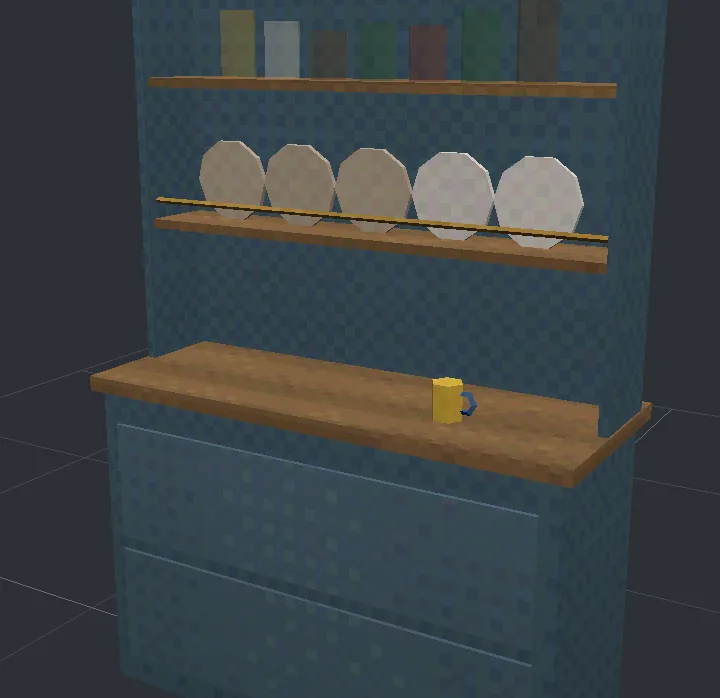
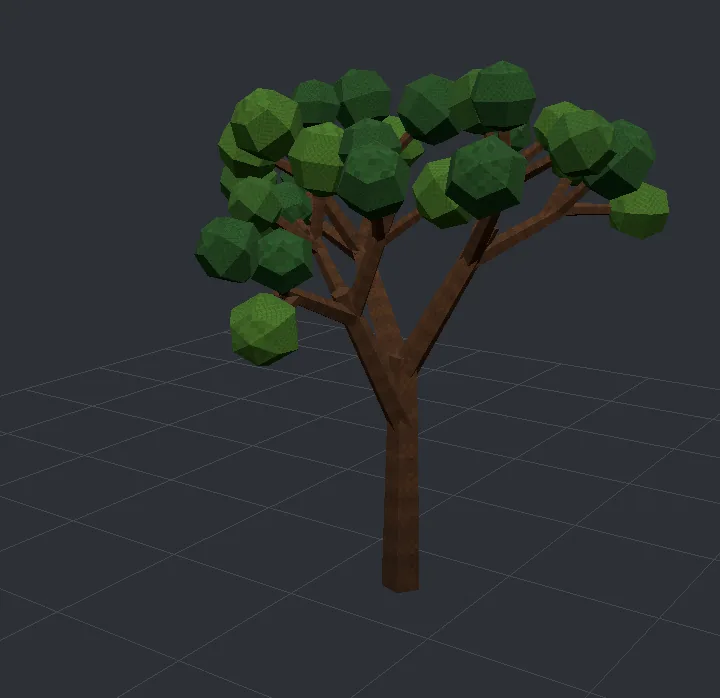
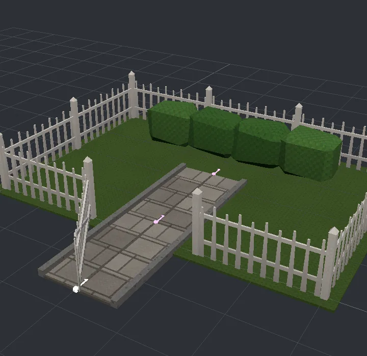
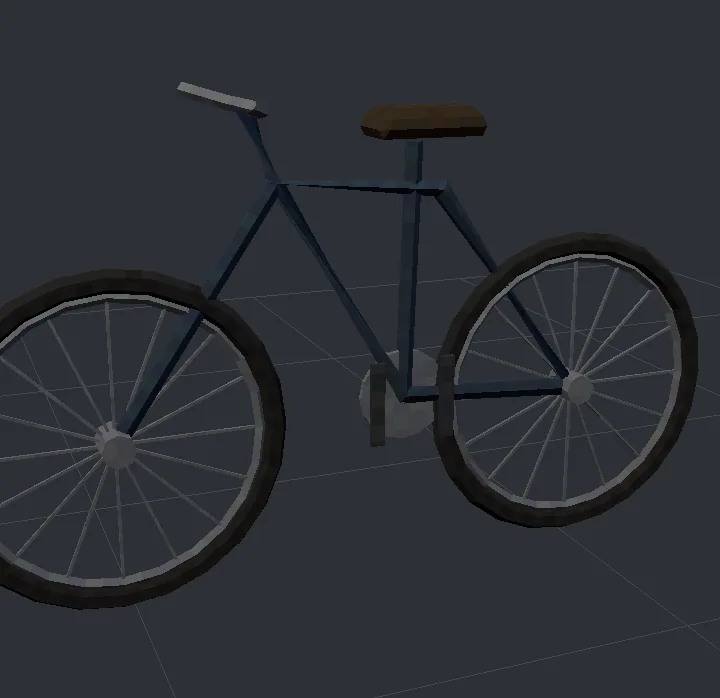
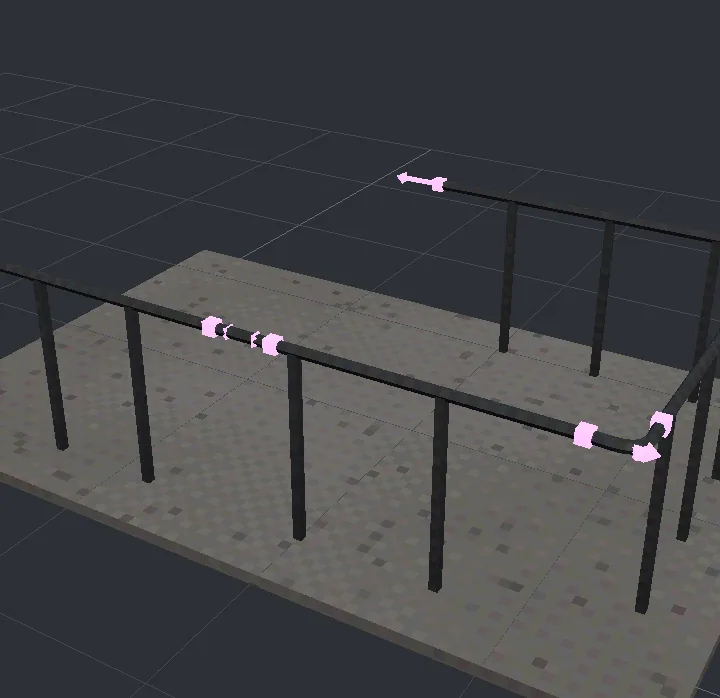

# Gallery

The project's example files, built and pictured. Each lives in `examples/`; open it in the
[playground](../../play.html) to change it, or in the [preview](../../viewer.html) to orbit it and light up
which line made what.

## The hill chapel

`ruins.parts`. A hill of `terrain`, walls knocked about with `break=` and rubble at their feet, moss and
ivy grown over them with `scatter on`, graves dropped onto the slopes with `drop=lean`, a path of flags
down the hill, and a dead tree that grows itself.

## Fairground

`fairground.parts`. A Ferris wheel whose gondolas go round its rim by `cos()` and `sin()` of the copy's
number and hang level; a carousel of horses at heights out of step under a striped canopy; strings of
bulbs that sag between their poles (`hang=`); the street's market stalls.

## Tavern

`tavern.parts`. Built from two libraries in `library/`: furniture imported with a name
(`furniture.table`, `furniture.chair`, `furniture.settle`, `furniture.keg`) and tableware imported
plainly (`tankard`, `candlestick`), every part called like a shape. Its own `settle` and `oak` sit beside
the library's without touching them.

## Ruin stages and standing stones

`ruins.parts`. `break=0`, `.2`, `.4` and `.6` on one wall, with moss on whatever top is left; a ring of
stones dropped onto a moor and leaning with it, one fallen, lichen on their faces.

## An apartment block

`buildings.parts`. A kit of brick walls, windows, doors, floors and a dog-leg stair; a building laid out
room by room: a shop and its store room below, a flat on each floor above, a stair hall up one side.
Every room is furnished by a part that knows the room's size and where its doors are, and draws its own
colours and clutter, storey by storey.

## Graveyard

`graveyard.parts`. No two stones alike: five kinds of headstone, each with a name and dates drawn for it,
leaning its own way; bones of drawn lengths pushing up out of the graves.

## Placing by name

`layout.parts`. Built with names, `on=`, `row`, `stack` and `from=`/`to=`, and no adding up.

## Smaller things

`garden.parts`, `paths.parts`, `showpieces.parts`: a tree that is a branch carrying smaller branches; a
garden whose fence, posts and hedge follow one line of points; a bicycle of tori and pipes; short rail
runs joined into one by `link` and `join`.
